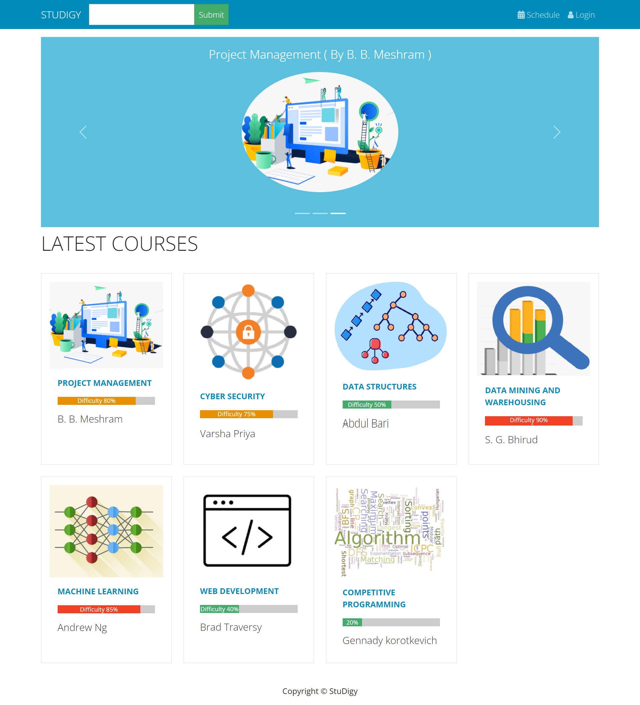

# Studigy

***Studigy*** (Study Digitally) is a platform that gives students an array of digital academic and social tools to stay engaged with their studies, peers and broader university community during pandemic.

Live Demo can be viewed at https://studigy.herokuapp.com/

Regardless of the pandemic condition, education must continue. Students and professors can use ***Studigy's*** hybrid approach to enrol in courses of their choice and schedule lectures online or offline, depending on their preferences. 

## Features
- ***Studigy*** shows the latest courses offered by various tutors with competence in their fields, together with the difficulty rating for each course received from students enrolled in those courses.

- It allows students to add lectures to their schedule and fill out their schedule attendance preferences. Their preferred mode of attendance (online/offline) as well as their vaccination status are included in their attendance preferences.

- It allows the administrator (teacher) to keep track of students, courses, and schedules. A teacher can create a new course and mark students' attendance for any schedule.

- Each course includes a discussion forum where students can post their doubts or comments, and teachers can contribute relevant resources to help students.

- It contains a search option that allows you to look up any Course. 

## Technology stack
1. Backend - Django(Python)
2. Database - PostgreSQL/ SQLite3
3. Frontend - React, Bootstrap

## Steps to Run
1. Clone project: git clone https://github.com/hrimG/Studigy.git
2. cd backend
3. Create virtual environment: virtualenv myenv
4. myenv\scripts\activate
5. pip install requirements.txt
6. python manage.py run server
